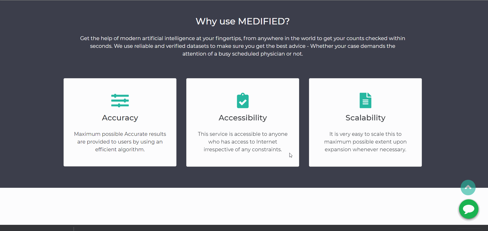

# Medified-Health-Assistant

Project for the submission of Tech Crawler Hackathon

Medified is an instant medical checkup service. It will predict the chances of getting disease to the patient by collecting patients health conditions as input.Using machine learning we built models for some diseases to predict health condition of the patient through a series of inputs from the patient.

*You can check the demo of the project [here](https://adhilcodes.github.io/Medified/)*

# Key Features
1) Responsive UI to make it more user-friendly.
2) Can access at any time anywhere.
3) Chatbot service.
4) The user will get a Medical Report after the checkup.
5) Covid status tracker.

# Libraries&Tech stacks Used:

1)Sci-kit Learn

2)Python Flask

3)Numpy&Pandas

4)HTML, CSS& Bootstrap

# Steps used for Deployment:

1) Performed [EDA(Exploratory data analysis)](EDA) on the datasets to find best the features.

2) Created the Machine Learning models and saved it using joblib.

3) Created backend using python flask.

4) Created UI for main page and pages it will redirect to.

5) Created a chatbot with  [Dialougeflow](https://dialogflow.cloud.google.com/) and deployed it using [kommunitcate](https://www.kommunicate.io/product/dialogflow-integration)

6) Deployed all ML models in Heroku and Hosted the website in Github pages.

# Dataset used

       
        1) [Breast Cancer](https://www.kaggle.com/uciml/breast-cancer-wisconsin-data): Winconsin Breast Cancer Dataset

        2) [Diabetes](https://www.kaggle.com/uciml/pima-indians-diabetes-database): Pima Indian Diabetes Dataset

        3) [Heart](https://www.kaggle.com/ronitf/heart-disease-uci): Heart Disease Dataset

        4) [Kidney](https://www.kaggle.com/mansoordaku/ckdisease): Chronic Kidney Disease Dataset

# Project Created by:
  [Abdul Adhil PK](adhilcodes.me)    
  
  [Muhammed Hashir PM](hashirpm.github.io/)
